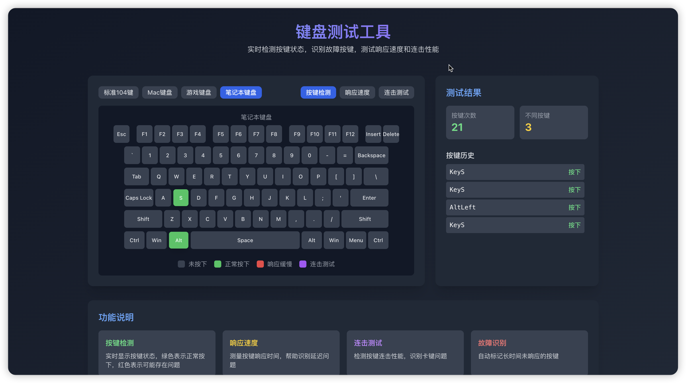
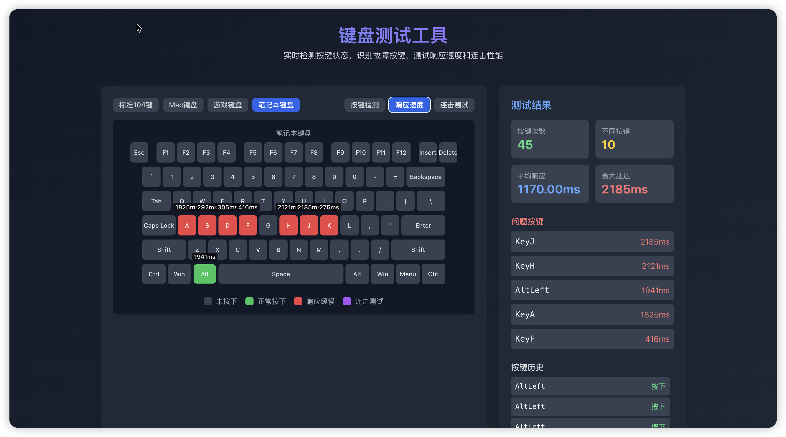
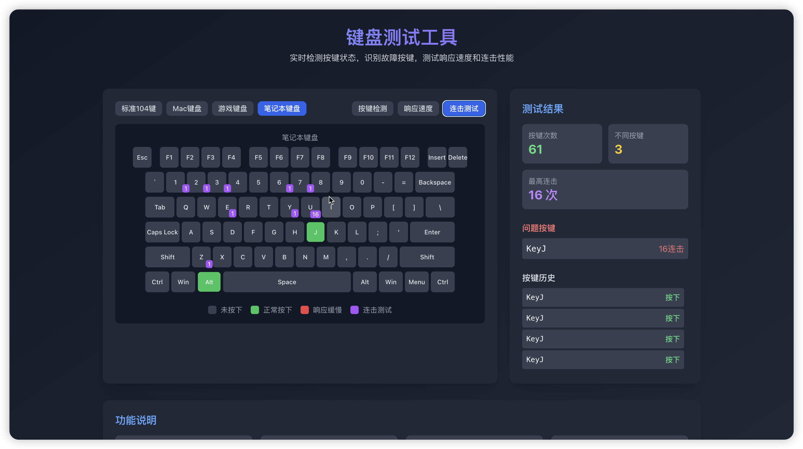
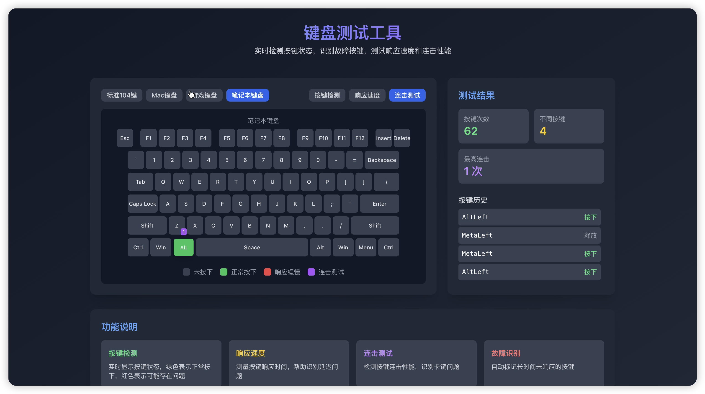
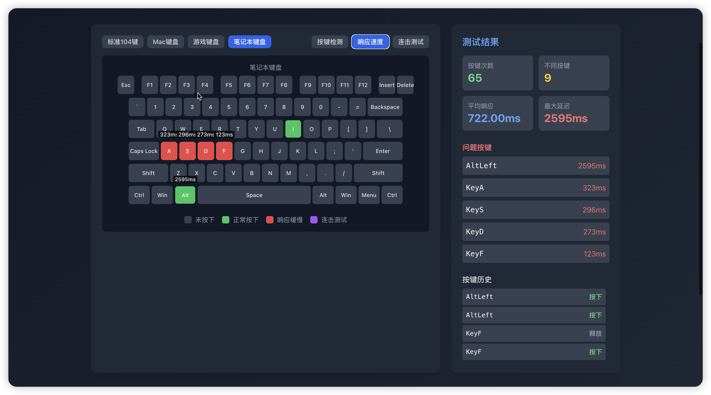

# ⌨️ 从灵感到上线：我用阿里云ESA Pages做了个键盘测试工具！🚀

## 💡 为什么参加这个比赛？

作为一个程序员，键盘就是我的武器！但最近发现键盘有些按键不太灵敏，打游戏总输、打字经常按错...想找个测试工具却发现：

要么是收费软件，要么是功能简陋的网页版，要么还需要下载安装...😓

正好看到**阿里云ESA Pages边缘开发大赛**，想着不如自己做一个真正好用的键盘测试工具！

**被吸引的点：**
✨ 零成本部署 - 无需购买服务器，完全免费
✨ 全球加速 - ESA边缘节点，访问速度超快
✨ 开源友好 - 完美适配前端项目，支持 Git 集成
✨ 一键部署 - 配置简单，自动构建
✨ 赛事奖励丰厚 - 雷蛇机械键盘！动力满满！💪

## 🛠️ 技术实现亮点

### 核心技术栈
- **React 18** - 组件化开发，Hooks 状态管理
- **Vite** - 极速构建工具，开发体验极佳
- **Tailwind CSS** - 原子化样式，快速实现响应式设计
- **Lucide React** - 现代化图标库

### 项目核心功能
1️⃣ **实时按键检测** - 按下键盘任意键，立即显示状态
   - 🟢 绿色 = 正常工作
   - 🔴 红色 = 响应缓慢（>100ms）
   - 🟣 紫色 = 连击测试模式

2️⃣ **三种测试模式**
   - **按键检测**：查看每个按键的按下/释放状态
   - **响应速度**：测量按键响应时间，数值越低表示响应越快
   - **连击测试**：快速连续按键测试连击性能，识别卡键问题

3️⃣ **多种键盘布局支持**
   - 标准104键（全尺寸键盘）
   - Mac 键盘
   - 游戏键盘
   - 笔记本键盘

4️⃣ **智能统计分析**
   - 实时显示按键次数、不同按键数量
   - 自动计算平均响应时间、最大延迟
   - 问题按键自动识别和排序
   - 按键历史记录（最近100条）

### ESA Pages 功能使用
1️⃣ **自动化部署配置**
```json
// esa.jsonc 配置
{
    "name": "keyboard-tester",
    "installCommand": "npm install",
    "assets": {
        "directory": "./dist",
        "notFoundStrategy": "singlePageApplication"
    }
}
```
只需配置这几个参数，ESA就能自动构建和部署！超简单！

2️⃣ **SPA 404处理**
使用 `singlePageApplication` 策略，所有路由都指向 index.html，虽然本项目是纯前端应用，但这个配置为后续扩展提供了基础。

3️⃣ **边缘加速体验**
部署完成后，全球用户访问速度都超快，这就是边缘计算的威力！⚡

### 性能优化技巧
1. **React Hooks 优化** - 使用 `useCallback` 缓存事件处理器，避免不必要的重新渲染
2. **状态管理优化** - 使用函数式 setState 避免闭包问题
3. **历史记录限制** - 只保留最近100条按键事件，避免内存占用过大
4. **CSS 压缩** - PostCSS + autoprefixer 自动优化样式
5. **Tree Shaking** - Vite 自动移除未使用代码
6. **响应式设计** - Tailwind 断点适配桌面、平板

### UI 设计亮点
- 🎨 深色主题，护眼舒适
- 🌈 渐变色标题，现代感十足
- 📊 三栏布局：左侧布局选择 + 中间键盘展示 + 右侧测试结果
- 💫 平滑过渡动画，按键按下有缩放效果
- 📱 完美适配移动端

## ⚠️ 遇到的挑战与解决方案

### 挑战1：不同键盘布局适配
**问题**：104键、Mac键盘、游戏键盘、笔记本键盘...布局差异太大！如何统一管理？

**解决方案**：
- 创建独立的 `keyboardLayouts.js` 配置文件，每种布局用 `rows` 数组定义
- 使用模块化设计，每种布局单独配置
- 支持 2D 键盘渲染，支持自定义按键宽度（如 Space、Enter、Shift 等长按键）
- 支持用户动态切换布局类型，切换时自动清空测试数据

### 挑战2：按键状态实时更新性能优化
**问题**：高频按键事件（比如快速打字）可能导致页面卡顿，如何保证流畅性？

**解决方案**：
- 使用 React `useCallback` 缓存 `handleKeyDown` 和 `handleKeyUp` 函数
- 状态更新使用展开运算符和函数式 setState，确保依赖正确
- 使用 `useEffect` 正确添加/移除事件监听器，避免内存泄漏
- 限制历史记录为最近100条，防止数组无限增长

### 挑战3：移动端适配
**问题**：屏幕小，完整键盘布局展示困难，如何保证可用性？

**解决方案**：
- 使用 Tailwind 响应式断点（`md:`、`lg:`）
- 在移动端使用更紧凑的间距和字体
- 键盘区域使用横向滚动支持，在小屏幕上也能查看完整布局
- 调整字体大小为 `text-xs`，确保所有按键标签可见

### 挑战4：ESA Pages 首次部署
**问题**：首次部署遇到构建失败，404页面错误，不知道哪里出了问题...

**解决方案**：
- 检查 `dist` 目录是否正确生成，确保 `npm run build` 成功
- 配置 `notFoundStrategy: "singlePageApplication"`
- 确保 `assets.directory` 路径正确（`./dist`）
- 在本地先执行 `npm run preview` 确认构建产物可用

### 挑战5：三种测试模式的实现
**问题**：如何在一个键盘界面中同时支持三种不同的测试模式？

**解决方案**：
- 使用 `testMode` state 管理当前模式（detection/speed/combo）
- 每种模式记录不同的数据：
  - detection：只记录按键状态
  - speed：计算响应时间（两次按下之间的时间差）
  - combo：计算连击次数（100ms内连续按下）
- 键盘组件根据 testMode 动态显示不同的提示信息（响应时间、连击数）

## 🎓 收获与成长

### 技能提升
✅ **React Hooks 深入理解** - 掌握了 useCallback、useEffect、useMemo 的正确使用方法
✅ **前端性能优化** - 学会了避免不必要的渲染、优化事件处理器
✅ **Tailwind CSS 高级用法** - 响应式设计、深色主题、动画效果
✅ **键盘事件处理** - 深入了解 keydown/keyup 事件和 event.code/event.key 的区别
✅ **边缘计算实践** - 了解了 CDN、边缘节点的实际应用
✅ **UI/UX 设计** - 学会了从用户角度设计界面，提升可用性

### 认知升级
🧠 边缘计算不再是概念，而是触手可及的工具
🧠 开源项目可以快速落地到生产环境
🧠 好的工具需要考虑性能、可用性、美观性
🧠 技术分享和社区交流的重要性
🧠 比赛是提升技术的绝佳途径

### 社区连接
通过这次比赛：
- 👋 认识了很多志同道合的开发者
- 💡 学习到其他优秀作品的设计思路
- ❤️ 感受到阿里云技术团队的支持和热情
- 📝 写这篇分享，希望能帮助到更多人

## 💡 对 ESA Pages 的使用建议

### 优点总结
✅ **部署简单** - 一键部署，无需复杂配置，新手友好
✅ **访问速度快** - 边缘节点全球覆盖，用户体验极佳
✅ **完全免费** - 个人开发者友好，降低门槛
✅ **支持 CI/CD** - 自动构建部署，Git 集成完美
✅ **HTTPS 支持** - 自动配置证书，安全访问
✅ **配置灵活** - JSON 配置文件简单直观

### 期待的功能
🔹 更多构建工具预设（如 Next.js、Nuxt.js、Astro）
🔹 更详细的部署日志和错误提示
🔹 预览环境（production 环境前先预览）
🔹 多环境支持（dev/staging/prod）

### 最佳实践建议
1. 使用 `singlePageApplication` 策略处理 SPA 路由
2. 确保 `assets.directory` 配置正确（注意相对路径）
3. 提前在本地测试构建，避免部署失败
4. 利用 `installCommand` 自动安装依赖
5. 配置 `notFoundStrategy` 提升 SEO 和用户体验
6. 使用 Git 管理代码，触发自动构建

## 📸 项目展示

###   
[https://u-keyboard.39b9884f.er.aliyun-esa.net/]

### 功能截图

**图1：主界面 - 实时按键检测**

说明：绿色表示正常按下，右侧实时显示测试结果

**图2：响应速度测试模式**

说明：按键上方显示响应时间（毫秒），自动计算平均响应和最大延迟

**图3：连击测试模式**

说明：快速按键测试连击性能，紫色显示高连击次数

**图4：多种键盘布局切换**

说明：支持标准104键、Mac、游戏、笔记本等多种布局

**图5：测试结果详情面板**

说明：详细的按键统计、问题按键识别、按键历史记录


## 🎁 参赛感悟

参加这次**阿里云ESA Pages边缘开发大赛**，不仅让我完成了一个实用的工具，更重要的是：

- 🚀 从0到1体验了完整的项目开发流程（需求分析 → 技术选型 → 功能实现 → 测试优化 → 部署上线）
- 🌍 感受到了边缘计算带来的访问体验提升
- 👥 加入了一个技术氛围浓厚的开发者社区
- 📚 学习了很多前端开发和部署的最佳实践
- 💪 提升了 React、Tailwind CSS、性能优化等技能
- ✨ 认识到好的工具应该简单、快速、美观

**这个键盘测试工具虽然功能看似简单，但每一处细节都经过反复打磨：**
- 键盘布局的精确配置
- 实时响应的性能优化
- 多模式的灵活切换
- 响应式的完美适配

**如果你也喜欢前端开发，或者有好的想法想要落地，强烈推荐参加这类比赛！**不仅能提升技能，还能认识很多优秀的开发者！

---

**📌 项目信息**
- 项目名称：Keyboard Tester（键盘测试工具）
- 在线体验：[https://u-keyboard.39b9884f.er.aliyun-esa.net/]
- GitHub 仓库：[https://github.com/akss5768/U-Keyboard]
- 技术栈：React 18 + Vite + Tailwind CSS + Lucide React
- 部署平台：阿里云 ESA Pages

**💬 喜欢这个项目别忘了点赞收藏，有问题欢迎评论区交流！**

---

#阿里云ESA Pages #阿里云云工开物 #前端开发 #React #键盘测试 #技术分享 #边缘计算 #Vite #TailwindCSS
